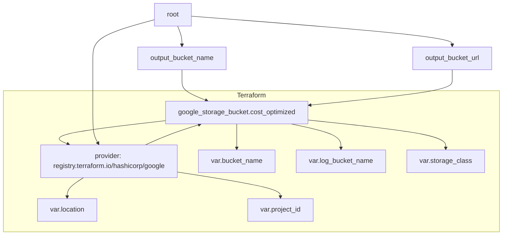

```mermaid
flowchart TD
    subgraph Terraform
        google_storage_bucket_cost_optimized["google_storage_bucket.cost_optimized"]
        provider_registry_terraform_io_hashicorp_google["provider: registry.terraform.io/hashicorp/google"]
        var_bucket_name["var.bucket_name"]
        var_location["var.location"]
        var_log_bucket_name["var.log_bucket_name"]
        var_project_id["var.project_id"]
        var_storage_class["var.storage_class"]
    end
    google_storage_bucket_cost_optimized --> provider_registry_terraform_io_hashicorp_google
    google_storage_bucket_cost_optimized --> var_bucket_name
    google_storage_bucket_cost_optimized --> var_log_bucket_name
    google_storage_bucket_cost_optimized --> var_storage_class
    output_bucket_name --> google_storage_bucket_cost_optimized
    output_bucket_url --> google_storage_bucket_cost_optimized
    provider_registry_terraform_io_hashicorp_google --> google_storage_bucket_cost_optimized
    provider_registry_terraform_io_hashicorp_google --> var_location
    provider_registry_terraform_io_hashicorp_google --> var_project_id
    root --> output_bucket_name
    root --> output_bucket_url
    root --> provider_registry_terraform_io_hashicorp_google
```
